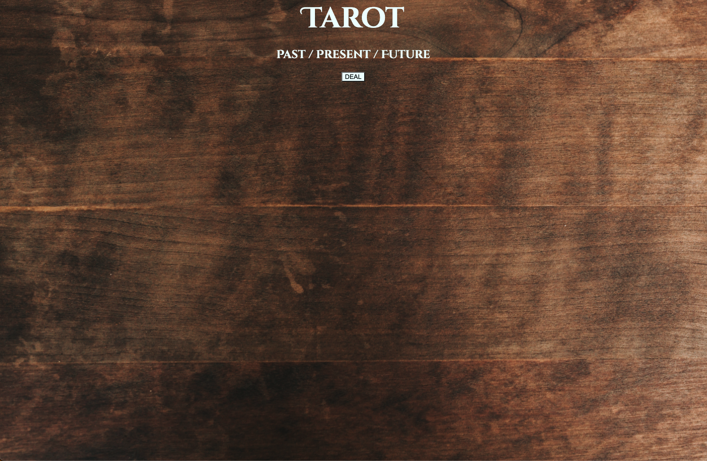
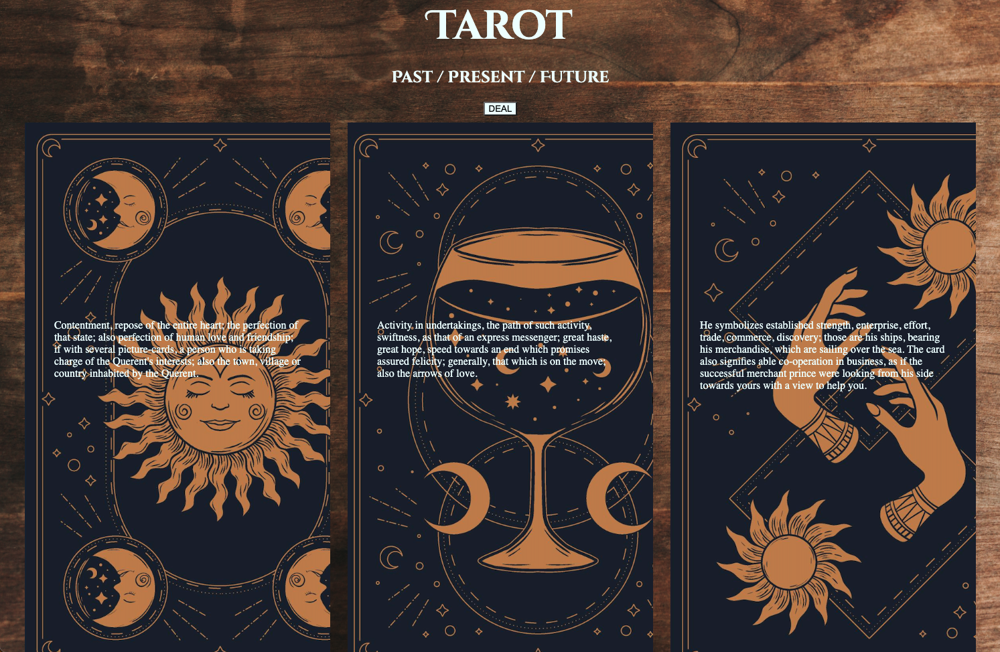

<h1>Title</h1>
<h2>Tarot Past / Present / Future</h2>

 

<h1>Technologies Used:</h1>
<ul>
    <li>HTML5</li>
    <li>CSS3</li>
    <li>JavaScript</li>
    <li>jQuery</li>
    <li>Google Fonts</li>
    <li>Tarot API</li>
</ul> 

 

<h1>Screenshots:</h1>

 

<h1>Getting Started</h1>

<a href='https://profound-entremet-2e58ba.netlify.app'>
 
<h1>Future Enhancements:</h1>
<ul>
    <li>Adjust CSS to be more repsonsive</li>
    <li>Add card images for each card</li>
